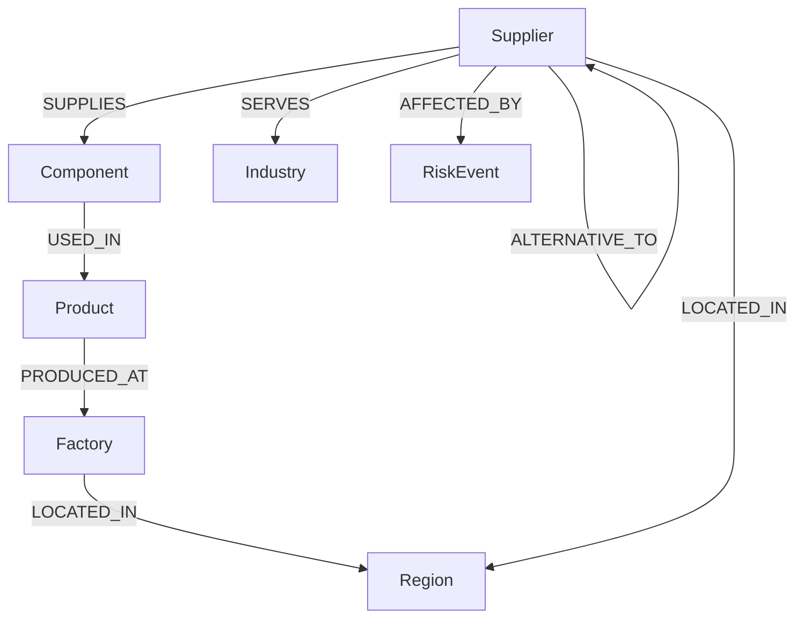

# ChainLens Graph Schema Model

## Nodes

* **Supplier** (e.g., id, name, location)
* **Component** (e.g., id, name, type)
* **Product** (e.g., id, name, sku)
* **Factory** (e.g., id, name, capacity)
* **Region** (e.g., id, name, country)
* **Industry** (e.g., id, name)
* **RiskEvent** (e.g., id, type, severity, description, status)

## Relationships

* `SUPPLIES`: Supplier $\rightarrow$ Component
* `USED_IN`: Component $\rightarrow$ Product
* `PRODUCED_AT`: Product $\rightarrow$ Factory
* `LOCATED_IN`: Factory $\rightarrow$ Region
* `LOCATED_IN`: Supplier $\rightarrow$ Region
* `SERVES`: Supplier $\rightarrow$ Industry
* `AFFECTED_BY`: Supplier $\rightarrow$ RiskEvent
* `ALTERNATIVE_TO`: Supplier $\rightarrow$ Supplier (Approved alternatives with attributes compatibility and switching_days)

## Primary Traversal Flow

$$\text{Supplier} \xrightarrow{\text{SUPPLIES}} \text{Component} \xrightarrow{\text{USED\_IN}} \text{Product} \xrightarrow{\text{PRODUCED\_AT}} \text{Factory} \xrightarrow{\text{LOCATED\_IN}} \text{Region}$$

## Mermaid Visual Representation

